# AWS SDLC

**Problem Statement:**

You are assigned to create a software development life cycle for an application your company has created. The company wants you to use AWS for the infrastructure part and AWS Developer tools for the pipeline part.

**Tasks to be performed:**

1. Create a website in any language of your choice and push the code into GitHub.
1. Migrate your GitHub repository into the AWS CodeCommit repository
1. Create two CodeDeploy deployments (for the QA stage and the Production stage) with an EC2 deployment group into which you can push the code from the CodeCommit repository
1. Using AWS CodePipeline, create a software development life cycle:
   1. The source is the CodeCommit repository.
   1. The code will be pushed into the deployment created in CodeDeploy.
   1. There should be two stages in deployment, the QA stage and the Production stage
   1. Only when the QA stage is successful, the Production stage should execute.
1. Create a third stage where the same website is pushed into an Elastic Beanstalk environment

# Let Us Start

**According to the given project, the first thing we will need is an HTML website in the github repo.**


**GitHub Repo all files we will use, breakdown:**

**Index.html:**

```
<!DOCTYPE html>
<html>
  <head>
    <style>
      body {
        font-family: Arial, sans-serif;
        background-color: #f2f2f2;
        color: #333;
        text-align: center;
      }
      
      h1 {
        font-size: 36px;
        margin-top: 50px;
        color: #6130e8;
      }
      
      p {
        font-size: 18px;
        margin: 20px 0;
      }
    </style>
  </head>
  <body>
    <h1>AWS Devops</h1>
    <p>Project</p>
  </body>
</html>

```
**Index.html explained:**

The given HTML code represents a simple webpage with a title "AWS DevOps" and a paragraph "Project". Here's a brief explanation of the code:

- The "!DOCTYPE html" declaration specifies the HTML version used in the document. The "html" element is the root element of an HTML page.
- The "head" element contains meta-information about the HTML document, such as styles, scripts, and title.
Inside the "head" element, there is a "style" block that defines the CSS styles for the webpage.
- The body element represents the content of the webpage and contains the visible elements.
The "h1" element represents a heading with the text "AWS DevOps". It has a larger font size, a margin-top of 50 pixels, and a specific color (#6130e8).
- The "p" element represents a paragraph with the text "Project". It has a font size of 18 pixels and a margin of 20 pixels on the top and bottom.
- The CSS styles specified in the "style" block define the appearance of the webpage, including the font family, background color, text color, and text alignment.
- In summary, the HTML code creates a webpage with a heading and a paragraph, styled using CSS to have a specific appearance.

**buildspec.yml:**

The given buildspec.yml file is used in the AWS CodeBuild service to define the build specifications and actions for a project. Here's a brief explanation of the contents:

- version: 0.2: Specifies the version of the buildspec file format.
phases: Represents different phases of the build process, such as installation, build, and post-build actions.
- install: Contains commands to be executed during the installation phase.
echo Installing NGINX: Prints a message indicating that NGINX installation is starting. sudo apt-get update: Updates the package lists on the system.
- sudo apt-get install nginx -y: Installs NGINX by using the package manager with automatic confirmation (-y).
- build: Contains commands to be executed during the build phase.
- echo Build started on date``: Prints a message with the current date and time.
- cp index.html /var/www/html/: Copies the index.html file to the /var/www/html/ directory. post\_build: Contains commands to be executed after the build phase.
- echo Configuring NGINX: Prints a message indicating that NGINX configuration is being performed.
- artifacts: Specifies the artifacts to be generated and uploaded after the build phase.
- files: Defines the files and directories to be included as artifacts.
- '\*\*/\*': Includes all files and directories recursively, capturing everything in the build environment as artifacts.

**In summary, this buildspec.yml file sets up an AWS CodeBuild project to install NGINX, copy an index.html file to the appropriate location, and generate artifacts that include all files and directories in the build environment.**

**appspec.yml:**
```
version: 0.0
os: linux
files:
  - source: /
    destination: /var/www/html
hooks:
  AfterInstall:
    - location: scripts/install_nginx.sh
      timeout: 300
      runas: root
  ApplicationStart:
    - location: scripts/start_nginx.sh
      timeout: 300
      runas: root

```

**The given appspec.yml file provides configuration for the deployment process using AWS CodeDeploy. 
Here's a brief explanation of the contents:**

- version: 0.0: Specifies the version of the AppSpec file format.
- os: linux: Specifies the operating system where the deployment will take place. files: Defines the files to be deployed.
- source: /: Specifies the source directory or files to be deployed. In this case, it represents the root directory of the application.
- destination: /var/www/html: Specifies the destination directory on the target instance where the files will be deployed. In this case, it points to the /var/www/html directory.
- hooks: Defines the lifecycle event hooks, which are actions to be executed at specific stages of the deployment.
- AfterInstall: Specifies the hook to be executed after the application files are installed.
- location: scripts/install\_nginx.sh: Specifies the location of the script to be executed. In this case, it points to install\_nginx.sh within the scripts directory.
- timeout: 300: Sets the timeout duration for the script execution to 300 seconds (5 minutes).
- runas: root: Specifies that the script should be executed as the root user. ApplicationStart: Specifies the hook to be executed after the application is started.
- location: scripts/start\_nginx.sh: Specifies the location of the script to be executed. In this case, it points to start\_nginx.sh within the scripts directory.
- timeout: 300: Sets the timeout duration for the script execution to 300 seconds (5 minutes).
- runas: root: Specifies that the script should be executed as the root user.

**In summary, this appspec.yml file defines the deployment process for an application on a Linux operating system. It includes the files from the root directory of the application and deploys them to the /var/www/html directory. It also specifies the execution of two scripts, install\_nginx.sh and start\_nginx.sh, after the installation and application start stages, respectively. The scripts are executed as the root user with a timeout of 300 seconds for each.**

Now we need HTML website in codecommit.
For this first create a codecommit repo in aws through console. Search for codecommit service in aws console.

Click on create repository.


JUst name it and click on create repo.


Now we want to clone github repo to codecommitt.
For this, create a IAM user. Goto: IAM>User>Create User.


Just give a name to the user and give codecommit full access to it.


Now generate an IAM access key by going into: IAM>Users>User we created>security credentials>create access key


GIT credentials required are created.


Now in your local machine install git and clone the github repo to it. For this use commands:
Sudo apt-get install git
Git clone <github repo clone link>


Copy all the contents of this repo into another folder.
Use command:
cp -r /home/ubuntu/github cloned folder name/\*\* /home/ubuntu/<new folder name>


Now push this new folder to codecommit repo. USe this command in that folder. Git init
Git add .
Git commit -m “message.”


Now let us push it to code commit.
Use command: git remote add origin <codecommit repo link> Git push -u origin master


In credentials part, we will enter the credentials we created using IAM user before.


Changes has been reflected in our codecommit repo.


Now let us create 2 deployments, QA and Prod in EC2 deployment groups. 
Goto AWS CodeDeploy>Create Application from AWS console.
Give name to ur app and choose ec2/on prem as your compute platform.


Now create 2 instances for QA and Prod. Also we will attach role to it so that it can access codecommit.


Now we need to install CodeDeploy Agent into them. Use these commands:

sudo apt-get install ruby -y
sudo apt-get install wget -y
cd /home/ubuntu # Change the directory to your desired location
wget https://aws-codedeploy-us-east-1.s3.us-east-1.amazonaws.com/latest/install 
chmod +x ./install
sudo ./install auto
sudo service codedeploy-agent start

So code deploy agents are up and running in both qa and prod instances after using above commands.


Let us create a Deployment Group


Give it a name and attach role to it with proper permissions.


Add tags of QA and Prod instance and create deployment group.


We need to create CodeBuild aswell. Also the build is stored in s3. Let us create s3 bucket for this.


Block all public access. Create a bucket.


Now let us create a build project. First just give name to build project.


Select your source repo and branch.


Select environment


We will add artifacts later. Create build.


Click on start build


Build is successful


Let us add s3 as artifact.

Goto build and click on edit and add artifacts.


Choose the bucket in which you want artifact to be in.


Let us package it in .zip


Now start build after setting up artifacts.
You can see that after successful build .zip file will reflect in s3.


Now we have created CodeDEPLOY Application before. Create 2 codedeploy groups in it. Here we choose QA tags


Select never because we already installed agents before.


Similarly, while creating deployment group for prod select prod instance tags.


Let us create deployment for QA group first.


In Deployment settings add artifacts s3 url and file type.


Create Deployment


Deployment succeeded.


Similarly create deployment for prod deployment group.


PROD deployment is also done.


We can copy public ip and check both the instances deployments.


Now, we need to create a pipeline. Create pipeline:


Give it a name and let the role be default one and next.


Our source provider is codecommit so select it.


Our build provider is codebuild. Select the build that we created.


Our deploy provider is codedeploy. Select QA for now. We will add Prod in pipeline later.


Create pipeline.


Current pipeline is working fine.


What we want is after QA is successful PROD should get triggered. Also if PROD is successful Beanstalk should update the code.

Let us create BeanStalk environment first.


Give name to your application. Select php as platform.


Click on next.

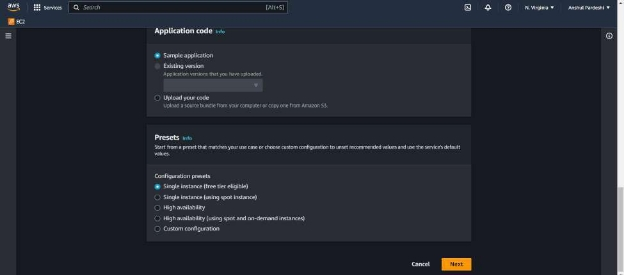

Give necessary permission through role and select instance details.

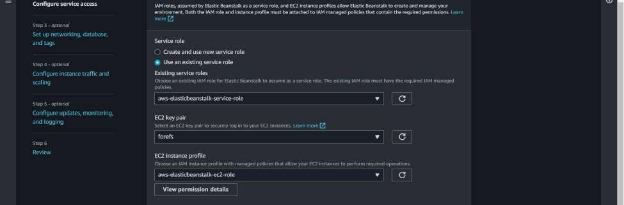

Choose VPC and AZ in which you want the instance.

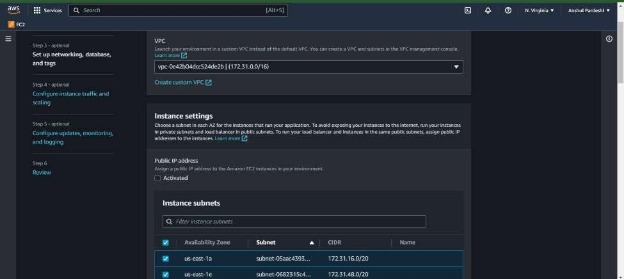

Select storage type and other specs needed according to you.

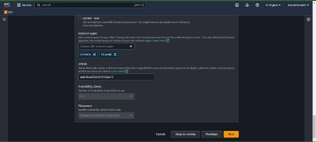

Recheck all settings and submit.

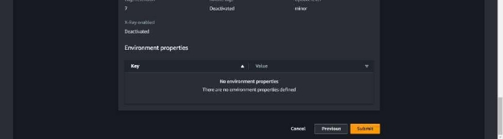

Environment is fully launched.

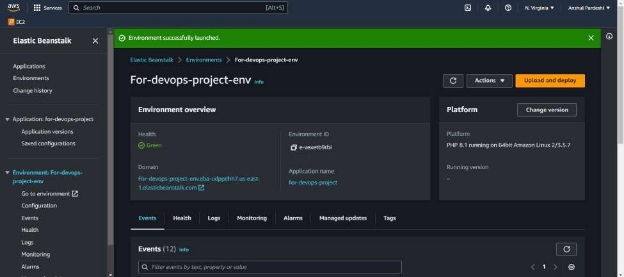

Now Goto pipeline.

After codedeploy stage click on add stage. Give it a name.


Add prod codedeploy.

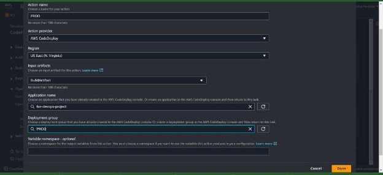

Now add AWS BeanStalk ENV Choose appropriate beanstalk env.

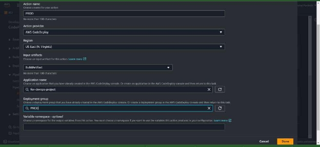

Click on save.


Let us make change in CodeCommit. Add extra line to it. Before change:

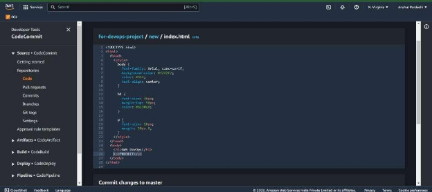

After change:

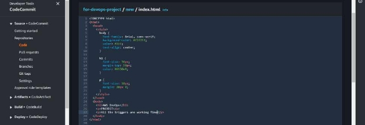

Commit it and lets see if it gets reflected in QA, PROD and Beanstalk ENV instance through pipeline.
Commit done.

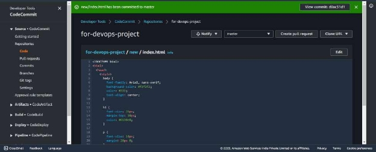

Pipeline is successful.

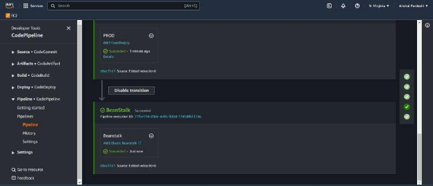

Let us check all ip’s of all three instances. QA


PROD


AWS Elastic BeanStalk


